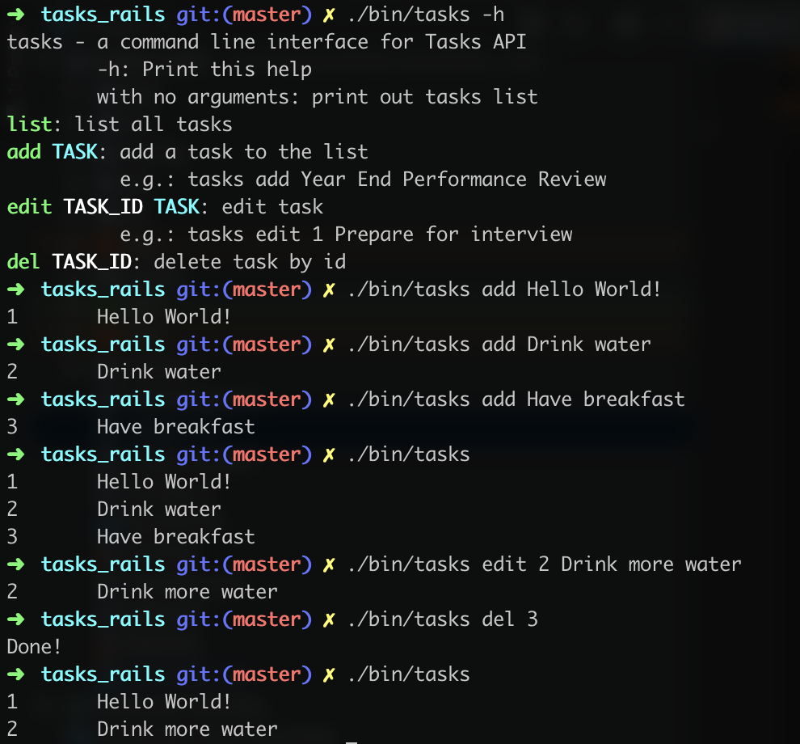

# Tasks in Rails

A simple tasks CRUD api server providing both RESTful and GraphQL API, written in Ruby on Rails



## Architecture

A Ruby on Rails application follows the standard MVC pattern.

The Model encapsulates database access and domain logic in an ActiveRecord object - in this app, the [task.rb](app/models/task.rb)

The Controller acts on model and view. It controls data flow (based on the [routes](config/routes.rb)) into model object.

The View represents the visualization of data that model contains - in this app, the JSON output.

### Why choosing current stack

Ruby is the most programmer friendly language and [Ruby on Rails](https://rubyonrails.org/) is the best tool to build a quick prototype or an MVP IMHO.
It compresses(encapsulates) all the concepts and liberates productivity from the grasp of complexity,
so you do not have to worry about many low level details, such as *database index*, *connection pool*,  *XML configurations*, *object life cycle*, etc.

Rails follows the REST convention so you can build a RESTful API in just one second

```sh
rails new scaffold task
```

and it gives you everything you need - ORM, resources based routes and controllers, HTTP status code in the right way.

And it's easy to build a GraphQL layer along with RESTful API.

This app is using SQLite3, an embedded database to minimize the effort of deployment, but we can also switch to PostgreSQL/MySQL/MongoDB/Redis easily.

## RESTful API routes

The routes follows RESTful convention.

| Verb   | URI Pattern | Controller#Action |
|--------|-------------|-------------------|
| GET    | /tasks      | tasks#index       |
| POST   | /tasks      | tasks#create      |
| GET    | /tasks/:id  | tasks#show        |
| PATCH  | /tasks/:id  | tasks#update      |
| PUT    | /tasks/:id  | tasks#update      |
| DELETE | /tasks/:id  | tasks#destroy     |

## GraphQL interfaces

GraphQL support via [graphql-ruby](https://github.com/rmosolgo/graphql-ruby)

Supports all CRUD actions. Sample query

```graphql
query GetTasks() {
    tasks() {
        id
        title
    }
}

query GetTask($id: ID!) {
    task(id: $id) {
        id
        title
    }
}

mutation CreateTask($title: String!) {
    createTask(title: $title) {
        task {
            id
            title
        }
    }
}

mutation EditTask($id: ID!, $title: String!) {
    editTask(id: $id, title: $title) {
        task {
            id
            title
        }
    }
}

mutation DeleteTask($id: ID!) {
    deleteTask(id: $id) {
        id
    }
}
```

## Command Line Interface

The [cli](bin/tasks) provides basic shell commands for API interactions.

The default server address is set to `http://localhost:3000/tasks`. Change it as you wish.

It requires [jq](https://stedolan.github.io/jq/) for JSON parsing, please install it by

```sh
brew install jq # macOS
```

OR

```sh
sudo apt-get install jq # Debian or Ubuntu
```

Without jq, it falls back to RAW json display.

### Usage

```sh
    ./bin/tasks -h                  # print help
    ./bin/tasks                     # list all tasks
    ./bin/tasks add Hello World     # Add task
    ./bin/tasks edit 1 Hello        # Edit task
    ./bin/tasks del 1               # Delete task
```

## Roadmap

1. Logging changes to file(using observer pattern) and database(with paper_trail gem). (**Done**)
2. Adding authentication(JWT token, Warden) and authorization(Pundit/cancancan)
3. Adding Kubernetes deployment script(helm)
4. Use Continuous Integration (CircleCI/Docker CI/Heroku) to do automatic deployment
5. Switch to Redis for distributed service